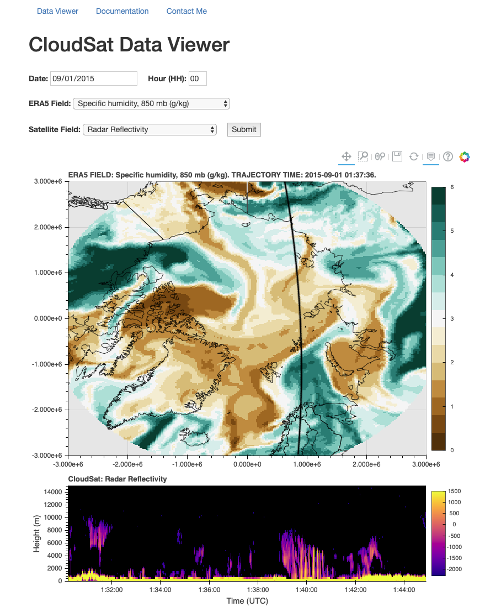

# CloudSat/CALIPSO/ERA5 Visualization Tool

Tool to help visualize data from CloudSat, CALIPSO, and the ERA5 renalysis product over the Arctic. The purpose of the tool is to bring these big and disparate datasets together into a single place, where they can be used for effective exploratory data analysis. 

A limited version of the visualization tool is available [here](https://cloudsat-arctic-visualization.herokuapp.com/). Due to application size constraints set by Heroku, only a few days of data are available in the online version. 

NOTE: The tool is still under development! 


## What's in this repository? 
* `figs`: Directory that contains any figures I generated while working on the project. 
* `notebooks`: Directory that contains the iPython notebooks I used to develop the visualization tool. 
* `scripts`: Directory that contains scripts I use to acquire, process, and then prepare the data for use in the  visualization tool. 
  * `download_cloudsat_data.py`: Script for downloading CloudSat data. When run, the script does not perform the entire download process automatically; rather, it guides you through the process of ordering data, asks you to input the information that's needed to download the data you ordered, and then performs the final download for you. 
  * `download_era5_data.py`: Similar to `download_cloudsat_data.py`, but for CALIPSO data. 
  * `download_era5_data.py`: Script for downloading ERA5 data. Before executing the script to begin the download, you'll need to adjust some parameters in the script that describe your download. 
  * `global_variables`: Defines two variables that will be used across the project. 
  * `global_functions_and_classes.py`: Contains definitions for a custom class (`radarPass`) and several functions that are used throughout the project. 
  * `create_radarPass_objects.py`. Run this script after downloading all the CloudSat/ERA5 data. The script will create radarPass objects for every satellite passage over the Arctic and save those objects to file. Those files will then be used to generate figures in the web application. 
* `web-app`: Directory that contains the tool's Flask application. 
  * `app.py`: Contains all the Python code for the application. 


## Installation

Because I use the conda package manager on my computer, I'll provide instructions for setting the tool up using conda. 

1. Fork the repository, download it to your own machine. 
2. Install conda on your machine, if it isn't already installed [instructions](https://docs.anaconda.com/anaconda/install/). 
3. Open a terminal and set up a new Python environment for the tool. For the purposes of these instructions, I'll name the environment 'cloudsat-viz', but you can name it whatever you want. 

```
conda create --name cloudsat-viz
```

4. Activate the environment. 

```
source activate cloudsat-viz
```

5. Install the tool's dependencies. 

```
conda install -c conda-forge python3 pandas geopandas shapely bokeh flask jinja2 pip gunicorn numpy netCDF4 rasterio matplotlib rtree pyhdf cdsapi
```

6. If the step above was succesful, the conda environment should be good to go. 

7. Use the command line to change into the `scripts` directory. Begin downloading CloudSat data by executing the following command and following the instructions that are printed to the terminal screen. 

```
python download_cloudsat_data.py
```

8. Begin downloading the CALIPSO data with a similar command. Note that you should be downloading the CloudSat and CALIPSO data for the same time periods. 

```
python download_calipso_data.py
```

9. Download the ERA5 data by opening `download_era5_data.py`, adjusting the `year`, `month`, `days`, and `hours` variables so that they reflect the dates for which you ordered CloudSat and CALIPSO data. The `hours` variable is a list of hours for which you want ERA5 data on *each day* in your request. Then begin the download using the following command: 

```
python download_era5_data.py
```

10. Once all the downloading is complete, process and merge the data from all three sources using the `create_radarPass_objects.py` script. The script has to work through a lot of data (a few dozen GB for a single month), so this could take a few hours. 

```
python create_radarPass_objects.py
```

Notes: 
* The data ordering/downloading process could take a long time, depending on how busy the NASA and ECMWF data processing systems are. It could easily take a few hours or half a day to acquire a month's worth of data. 

Troubleshooting: 
* Sometimes geopandas does not install propererly: when you try to import the `geopandas` module, an error is thrown because the `libspatialindex_c` library isn't available. The solution to this problem is available in this [Stack Overflow chain](https://stackoverflow.com/questions/53546775/overly-function-from-geopandas-not-working).  
* If any other problems arise, please open a GitHub Issue and I'll get to it as quickly as I can. 


## Usage

1. Once `create_radarPass_objects.py` finishes running (last step in previous section), you should be ready to use the web application! Change into the `web-app` directory and run the application. 

```
python app.py
```

2. In order to open the application in your browser, open your browser and enter the link that was written to the terminal during the previous step. Something like this should pop up: 



3. High-level documentation for the tool is available through the web application. 

## Authors

* **Lucien Simpfendoerfer**

## License

This project is licensed under the MIT License - see the [LICENSE.md](LICENSE.md) file for details
